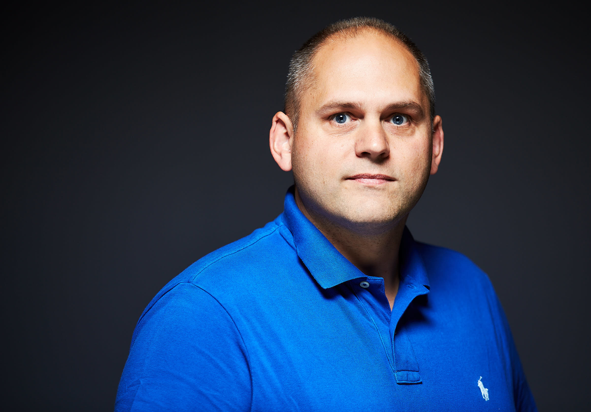

# Headshots

Various headshots below.  [martinwo_dark.png](martinwo_dark.png) is preferred but feel free to go with the one that works best for you.

**Name:** Martin Woodward

**Title:** Director of Developer Relations, GitHub

**Bio:** Martin is the Director of Developer Relations at GitHub where he helps developers and open source communities to create delightful things. Prior to that he was part of the team at Microsoft building the tooling for DevOps teams inside and outside the company where he helped change how the company built software, by helping them change how they work with open source communities and how they talk with developers.

